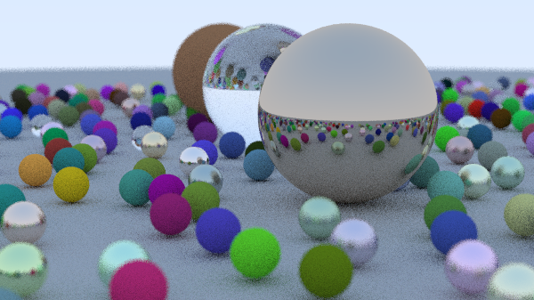

# RAYT

Ray Tracing codes. I follow Peter Shirley's [Ray Tracing](https://raytracing.github.io/) trilogy. The goal is to have the same output in three languages; C++, Python, and Rust.


## Build C++ Project


*assets/rayt_cpp_one_weekend.png*


*assets/rayt_cpp_next_week.png*

CMake will generate makefiles for your operating system. If you didn't use CMake before, take a look at the documentation to learn how to build a C++ project. Example usage:

```
cd rayt-cpp
cmake . -B build
cd build
make install
bin/rayt_one_weekend > image_one_weekend.ppm
bin/rayt_next_week > image_next_week.ppm
```

For Windows:
```
cd rayt-cpp
cmake . -G "NMake Makefiles" -B build
cd build
nmake install
bin/rayt_one_weekend.exe > image_one_weekend.ppm
bin/rayt_next_week.exe > image_next_week.ppm
```

Performance status:
```
time bin/rayt_one_weekend.exe > image_one_weekend.ppm
Scanlines remaining: 0
Done.

real    0m58,499s
user    0m58,486s
sys     0m0,009s
```

## Build Rust Project



I'll add a screenshot when the Rust project is ready.

```
cargo run > image.ppm
```

## Build Python Project


I tested the project using the latest stable version of Python (3.8).

```
cd rayt-python
pip install -r requirements.txt
python setup.py build_ext --inplace
python -m rayt_python.main > image.ppm
```

For development:
```
pip install -r requirements-dev.txt
python -m scalene rayt_python/main.py --html --outfile scalene.html
python -m pytest -s
python -m pytest -s -k test_subtraction
```

Performance status:
```
time python -m rayt_python.main > image.ppm
Scanlines remaining: 1
Done.

real    9m10,505s
user    29m21,547s
sys     0m3,749s
```
